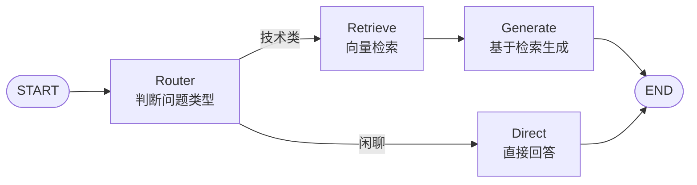

# LangGraph4j Agentic RAG 编排系统

基于 **LangGraph4j + Spring AI** 的 Agent 编排系统，演示状态图、条件路由、循环边、Checkpointer、Human-in-the-Loop、Agentic RAG 与 Multi-Agent Supervisor。


## 一、核心能力

- **状态图编排**：基于 LangGraph4j `StateGraph`，支持条件边、循环边、动态路由
- **Agentic RAG**：Router 节点判断问题类型，动态路由到检索或直接回答，避免无效检索
- **Multi-Agent Supervisor**：主管 LLM 分配任务给客服 / 技术 / 数据三个Agent Agent
- **Human-in-the-Loop**：按工具风险分级，查询类自动执行、写操作（退款/工单）需人工审批
- **多轮会话记忆**：Checkpointer + `threadId` 实现跨 invoke 状态恢复
- **双项目解耦**：通过 HTTP 调用独立的 RAG 服务，编排与检索各自演进

## 二、架构图


**Agentic RAG 分支图**：



## 三、技术栈

| 层 | 技术 |
|---|---|
| 编排框架 | LangGraph4j 1.9.0-beta6 |
| AI 框架 | Spring AI 1.1.0 |
| 大模型 | 通义千问（qwen-max / qwen-plus） |
| 序列化 | SpringAIJacksonStateSerializer |
| 检查点 | MemorySaver（开发）/ 可扩展 PostgresSaver |
| 构建 | Spring Boot 3.5.14 / JDK 21 |

## 四、快速开始

### 1. 环境准备

- JDK 21
- 通义千问 API Key（[百炼控制台](https://bailian.console.aliyun.com/)）

### 2. 配置

`src/main/resources/application.yml`：

```yaml
spring:
  ai:
    openai:
      api-key: ${DASHSCOPE_API_KEY}
      base-url: https://dashscope.aliyuncs.com/compatible-mode/v1
      chat:
        options:
          model: qwen-max
          extra-body:
            enable_thinking: false   # 关闭思考模式，避免 tool_calls 解析异常
```

设置环境变量：

```bash
# Windows
set DASHSCOPE_API_KEY=sk-xxxxxx

# Mac/Linux
export DASHSCOPE_API_KEY=sk-xxxxxx
```

### 3. 启动后端

```bash
mvn spring-boot:run
```

### 4. 启动前端（Vue 3 + Vite）

```bash
cd frontend
npm install
npm run dev        # 打开 http://localhost:5173
```

- 用内置账号登录后与三个 Agent 对话（账号见 `application.yml` 的 `app.auth.users`）；也可点"游客试用"（不登录，按 IP 限 5 次）
- HITL 审批：对 ReAct / Multi-Agent 说"订单 ORDxxx 我要退款"，Agent 调用敏感工具前会出现确认卡片，批准/拒绝后继续执行
- 开发模式通过 Vite 代理把 `/api` 转发到 `127.0.0.1:19091`（无需 CORS）；要直连后端可设 `VITE_API_BASE=http://127.0.0.1:19091`
- 生产构建：`npm run build` → `dist/`

## 五、核心接口

| 接口 | 说明 |
|---|---|
| POST `/api/auth/login` | 登录（不做注册，账号内置），返回 SM4 加密 token（存 Redis）与永久 threadId |
| POST `/api/auth/logout` | 登出，删除 Redis 中的 token 记录，该 token 立即失效 |
| POST `/api/reAct/reActSearch` | 智能客服调用工具 |
| POST `/api/reAct/approve` | HITL 审批（批准/拒绝） |
| POST `/api/multi/ask` | Multi-Agent Supervisor 任务分发 |
| POST `/api/multi/approve` | Multi-Agent HITL 审批 |
| POST `/api/agenticRag/ragSearch` | Agentic RAG 问答 |

### 1. 登录鉴权与未登录限次（token + threadId 双要素）

除 `/api/auth/**` 外，所有 `/api/**` 业务接口经过 `AuthFilter` 统一鉴权：

- **登录**：`POST /api/auth/login` 校验鉴权库中的账号，返回
  - `token`：SM4 加密的 `username|threadId|expireAt|uuid`（Base64Url），每次登录都不同，有效期 `app.auth.token-expire-minutes` 分钟（默认 30，0 = 永久）；登录时同步写入 **Redis**（key = SM3(token)，value = 身份与 threadId，TTL = 有效期），**校验以 Redis 为唯一事实源** → 支持登出吊销、应用重启不丢、到期自动清理
  - `threadId`：建账号时**随机生成**并持久化在 `t_user.thread_id`，**永久不变**，与用户名无任何推导关系（密钥泄露也推算不出）
  - `expireAt`：token 过期时间（毫秒时间戳，0 = 永久），前端据此提前重新登录
- **登出**：`POST /api/auth/logout` 带上 token 请求头即可，服务端删除 Redis 记录，该 token 立即失效
- **调用业务接口（已登录）**：请求头带 `Authorization: Bearer <token>` + 请求体带登录返回的 `threadId`。
  threadId 必须与 token 内嵌的一致（不一致返回 401；缺失时服务端自动回写）。
  threadId 只负责会话路由，单独泄露无法冒充身份
- **调用业务接口（未登录）**：不带 token → **客户端 IP 就是 threadId**（body 里即使带了别人的 threadId 也会被静默覆盖为 IP），
  每个 IP 限 `app.auth.anonymous-limit`（默认 5）次，超出返回 429 提示登录

```bash
# 登录
curl -X POST "http://localhost:9090/api/auth/login" \
  -H "Content-Type: application/json" \
  -d '{"username":"<内置账号>","password":"<密码>"}'
# 返回: {"token":"...","threadId":"u_xxxx-...","username":"...","expireAt":1758240000000}

# 登出（token 立即作废）
curl -X POST "http://localhost:9090/api/auth/logout" \
  -H "Authorization: Bearer <token>"

# 已登录调用（token 走请求头，threadId 走请求体）
curl -X POST "http://localhost:9090/api/agenticRag/ragSearch" \
  -H "Content-Type: application/json" \
  -H "Authorization: Bearer <token>" \
  -d '{"threadId":"u_ce910d5b-...","question":"你好"}'
```

**SM4 密钥**：通过环境变量 `AUTH_SM4_KEY` 配置（32 位 hex，`openssl rand -hex 16` 生成，或 16 字符的字符串），**不设默认值**，未配置时应用启动直接失败——密钥不入库、不入 git。

### 2. 数据源与 Redis

| 存储 | 位置 | 用途 |
|---|---|---|
| `primary`（第一个数据源） | PG `ai_demo` | AI Agent 主库，预留 pgvector / checkpointer |
| `auth`（第二个数据源） | PG `ai_auth` | 登录鉴权专用：`t_user`、`t_anonymous_quota` |
| Redis | `REDIS_HOST:REDIS_PORT`（默认服务器 911 端口） | token 服务端存储（可吊销、重启不丢、自动过期） |

鉴权库在启动时自动建表，并把 `app.auth.users` 中的内置账号写入 `t_user`（密码存 SM3 散列，已存在的账号不覆盖；threadId 随机生成只存库，旧版"由用户名 SM4 派生"格式的 threadId 会在启动时一次性迁移为随机值）；未登录 IP 调用计数持久化在 `t_anonymous_quota`，重启不清零，**超限后该 IP 会被打上 `blocked` 永久限流标记**——清零计数、重启应用均不解封，解封只能手动执行 `UPDATE t_anonymous_quota SET blocked = FALSE WHERE ip = '...'`；Redis 连接通过 `REDIS_HOST` / `REDIS_PORT` / `REDIS_PASSWORD`（默认取 `DB_PASSWORD`）配置。

连接指向：**prod 默认连本机**（服务与 PG/Redis 同机部署，`127.0.0.1`），**dev 默认远程连 `8.141.88.84`**；两种环境均可用环境变量 `DB_HOST` / `REDIS_HOST` 覆盖。

## 六、核心演示

### 1. Agentic RAG（智能路由）

```bash
# 技术类问题 → 走检索
curl -X POST "http://localhost:9090/api/agentic/ask" \
  -H "Content-Type: application/json" \
  -d '{"threadId":"u1","question":"LangChain 的核心定位是什么？"}'

# 闲聊 → 直接回答，不检索
curl -X POST "http://localhost:9090/api/agentic/ask" \
  -H "Content-Type: application/json" \
  -d '{"threadId":"u2","question":"你好，你是谁？"}'
```

**日志**：

```
[router] 判断结果: RETRIEVE
[retrieve] 调用 RAG 服务: LangChain 的核心定位是什么？
[generate] 基于检索结果生成
```

### 2. Human-in-the-Loop（人工审批）

```bash
# 敏感操作 → 返回 PENDING_APPROVAL
curl -X POST "http://localhost:9090/api/multi/ask" \
  -H "Content-Type: application/json" \
  -d '{"threadId":"u3","question":"订单 ORD12345678 我要退款"}'
# 返回: {"status":"PENDING_APPROVAL","threadId":"u3"}

# 人工批准
curl -X POST "http://localhost:9090/api/multi/approve" \
  -H "Content-Type: application/json" \
  -d '{"threadId":"u3","approved":true}'
# 返回: {"status":"COMPLETED","answer":"工单已创建..."}
```

### 3. 多轮会话记忆

```bash
# 第 1 轮
curl -X POST "http://localhost:9090/api/multi/ask" \
  -d '{"threadId":"u4","question":"帮我查订单 ORD12345678"}'

# 第 2 轮（同 threadId，Agent 记得订单号）
curl -X POST "http://localhost:9090/api/multi/ask" \
  -d '{"threadId":"u4","question":"物流到哪了"}'
# 直接查物流，不再追问订单号
```

## 七、项目结构

```
langgraph4j-demo/
├── frontend/ # Vue3 + Vite 前端（登录/三Agent对话/HITL审批/游客模式）
│ ├── src/api.js # 接口封装（token 头、错误处理）
│ ├── src/auth.js # 登录态管理（localStorage）
│ ├── src/components/LoginPanel.vue # 登录页
│ ├── src/components/ChatPanel.vue # 聊天主页
│ └── src/App.vue
├── src/main/java/com/example/langgraph4jdemo/
│ ├── chatClients/
│ │ └── MultiAgentChatClient.java # Multi-Agent 的多个 ChatClient 配置
│ ├── config/
│ │ ├── AuthProperties.java # app.auth 配置（SM4密钥/内置账号/限次）
│ │ ├── PrimaryDataSourceConfig.java # 第一个数据源（AI 主库）
│ │ ├── AuthDataSourceConfig.java # 第二个数据源（鉴权库）
│ │ ├── AuthDataInitializer.java # 鉴权库建表 + 内置账号种子
│ │ ├── AiInfraConfig.java # 基础设施：RestTemplate、ToolProvider
│ │ ├── ReActAgentConfig.java # ReAct Agent 图
│ │ ├── AgenticRagConfig.java # Agentic RAG 图（Router + Retrieve/Direct）
│ │ └── MultiAgentConfig.java # Multi-Agent Supervisor 图
│ ├── controller/
│ │ ├── AuthController.java # 登录接口（/api/auth/login）
│ │ ├── ReActController.java # ReAct Agent HTTP 接口
│ │ ├── AgenticRagController.java # Agentic RAG HTTP 接口
│ │ └── MultiAgentController.java # Multi-Agent HTTP 接口
│ ├── filter/
│ │ └── AuthFilter.java # 统一鉴权：token / 永久threadId / 未登录IP限次
│ ├── service/
│ │ ├── AuthService.java # 登录、SM4 token、永久 threadId
│ │ ├── AnonymousQuotaService.java # 未登录 IP 限次
│ │ ├── ReActService.java # ReAct Agent 服务
│ │ ├── AgenticRagService.java # Agentic RAG 服务
│ │ ├── MultiAgentService.java # Multi-Agent 服务
│ │ └── CustomerServiceAgent.java # 智能客服 Agent 封装
│ ├── util/
│ │ ├── Sm4Util.java # SM4 加解密（token / threadId 派生）
│ │ ├── Sm3Util.java # SM3 摘要（密码散列）
│ │ └── ClientIpUtils.java # 客户端真实 IP 解析
│ ├── web/
│ │ └── CachedBodyRequestWrapper.java # 请求体缓存包装（threadId 回写）
│ ├── state/
│ │ ├── MyAgentState.java # ReAct / Agentic RAG 状态
│ │ └── MultiAgentState.java # Multi-Agent 状态
│ ├── tools/
│ │ └── CustomerServiceTools.java # @Tool 工具定义（订单/物流/工单）
│ ├── dto/ # 请求/响应对象
│ └── Langgraph4jDemoApplication.java # 启动类
└── src/main/resources/
└── application.yml
```

## 八、踩坑记录

### 1. Spring AI 1.1.0 工具注册 API 变更

`.defaultTools(tools)` 已废弃，必须改用：``.defaultToolCallbacks(ToolCallbacks.from(tools))``

引入：`org.springframework.ai.support.ToolCallbacks`。

### 2. 千问兼容模式的 tool_calls 解析异常

`qwen3.8-2.4t-a95b` 在 OpenAI 兼容模式下，**有时会把工具调用写成 XML 文本**，而不是标准 `tool_calls` 字段。

**解决**：
- 换 `qwen-max`
- 或加 `extra-body.enable_thinking: false`

### 3. `interruptBefore` 需要 Checkpointer 配合

HITL 暂停后，状态必须被持久化，否则恢复时找不到现场。

```java
var saver = new MemorySaver();
var compileConfig = CompileConfig.builder()
        .checkpointSaver(saver)
        .releaseThread(false)   // 1.9 版本默认释放线程，多轮对话必须设为 false
        .interruptBefore("tools")
        .build();
```

### 4. State 字段无 Reducer 会被覆盖

`Channels.appender(ArrayList::new)` 才能让新消息**追加**而非**替换**：

```java
public static final Map<String, Channel<?>> SCHEMA = Map.of(
        "message", Channels.appender(ArrayList::new)
);
```

### 5. `state.value()` vs `state.data()`

加了 `SCHEMA` 后，`value("message")` 可能返回空。直接读 `data().get("message")` 更可靠：

```java
public List<Message> message() {
    Object raw = data().get("message");
    return raw instanceof List ? (List<Message>) raw : new ArrayList<>();
}
```

### 6. Agent节点不能执行工具

Multi-Agent 的Agent节点如果既调 LLM 又执行工具，会导致：
- 无法在工具执行前暂停（HITL 失效）
- 返回带 tool_calls 的 AssistantMessage，supervisor 判断"未完成"→ 死循环

**解决**：Agent只推理，工具执行抽成独立节点，才能 `interruptBefore`。

## 九、技术难点

| 难点 | 方案 |
|---|---|
| 智能路由 | Router 节点 + LLM 分类 + 条件边 |
| HITL 暂停与恢复 | `interruptBefore` + Checkpointer + `GraphInput.resume()` |
| 工具风险分级 | 条件边判断工具名，走 `tools`（暂停）或 `auto_tools`（直执行） |
| 工具执行后回到对应Agent | `current_expert` 字段 + 条件边动态路由 |
| 多轮会话记忆 | `Channels.appender` + Checkpointer + `releaseThread(false)` |
| 跨项目解耦 | HTTP 调用 RAG 服务，独立部署 |

## 十、License

本项目采用 [MIT License](LICENSE) 开源协议。

## 十一、作者

- GitHub: [@shuguang-liu](https://github.com/shuguang-liu)
## 相关文章

- [我用 LangGraph4j 实现 Multi-Agent Supervisor](https://juejin.cn/post/7688018731445075977)