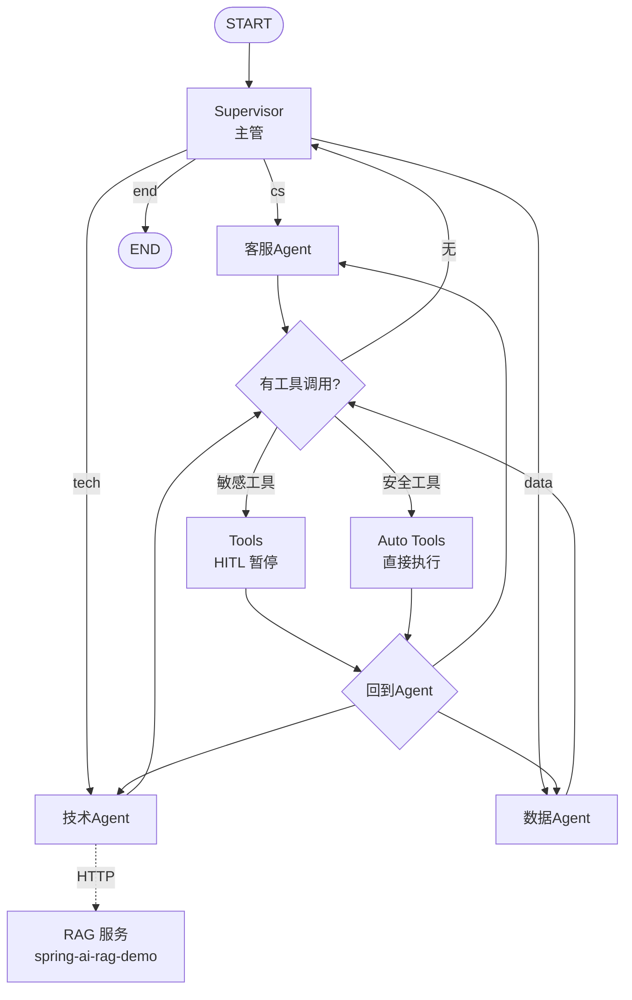

# LangGraph4j Agentic RAG 编排系统

基于 **LangGraph4j + Spring AI** 的 Agent 编排系统，演示状态图、条件路由、循环边、Checkpointer、Human-in-the-Loop、Agentic RAG 与 Multi-Agent Supervisor。


## 一、核心能力

- **状态图编排**：基于 LangGraph4j `StateGraph`，支持条件边、循环边、动态路由
- **Agentic RAG**：Router 节点判断问题类型，动态路由到检索或直接回答，避免无效检索
- **Multi-Agent Supervisor**：主管 LLM 分配任务给客服 / 技术 / 数据三个Agent Agent
- **Human-in-the-Loop**：按工具风险分级，查询类自动执行、写操作（退款/工单）需人工审批
- **多轮会话记忆**：Checkpointer + `threadId` 实现跨 invoke 状态恢复
- **双项目解耦**：通过 HTTP 调用独立的 RAG 服务，编排与检索各自演进

## 二、架构图



**Agentic RAG 分支图**：


## 三、技术栈

| 层 | 技术 |
|---|---|
| 编排框架 | LangGraph4j 1.9.0-beta6 |
| AI 框架 | Spring AI 1.1.0 |
| 大模型 | 通义千问（qwen-max / qwen-plus） |
| 序列化 | SpringAIJacksonStateSerializer |
| 检查点 | MemorySaver（开发）/ 可扩展 PostgresSaver |
| 构建 | Spring Boot 3.5.14 / JDK 21 |

## 四、快速开始

### 1. 环境准备

- JDK 21
- 通义千问 API Key（[百炼控制台](https://bailian.console.aliyun.com/)）

### 2. 配置

`src/main/resources/application.yml`：

```yaml
spring:
  ai:
    openai:
      api-key: ${DASHSCOPE_API_KEY}
      base-url: https://dashscope.aliyuncs.com/compatible-mode/v1
      chat:
        options:
          model: qwen-max
          extra-body:
            enable_thinking: false   # 关闭思考模式，避免 tool_calls 解析异常
```

设置环境变量：

```bash
# Windows
set DASHSCOPE_API_KEY=sk-xxxxxx

# Mac/Linux
export DASHSCOPE_API_KEY=sk-xxxxxx
```

### 3. 启动

```bash
mvn spring-boot:run
```

## 五、核心接口

| 接口 | 说明 |
|---|---|
| POST `/api/reAct/reActSearch` | 智能客服调用工具 |
| POST `/api/reAct/approve` | HITL 审批（批准/拒绝） |
| POST `/api/multi/ask` | Multi-Agent Supervisor 任务分发 |
| POST `/api/multi/approve` | Multi-Agent HITL 审批 |
| POST `/api/agenticRag/ragSearch` | Agentic RAG 问答 |

## 六、核心演示

### 1. Agentic RAG（智能路由）

```bash
# 技术类问题 → 走检索
curl -X POST "http://localhost:9090/api/agentic/ask" \
  -H "Content-Type: application/json" \
  -d '{"threadId":"u1","question":"LangChain 的核心定位是什么？"}'

# 闲聊 → 直接回答，不检索
curl -X POST "http://localhost:9090/api/agentic/ask" \
  -H "Content-Type: application/json" \
  -d '{"threadId":"u2","question":"你好，你是谁？"}'
```

**日志**：

```
[router] 判断结果: RETRIEVE
[retrieve] 调用 RAG 服务: LangChain 的核心定位是什么？
[generate] 基于检索结果生成
```

### 2. Human-in-the-Loop（人工审批）

```bash
# 敏感操作 → 返回 PENDING_APPROVAL
curl -X POST "http://localhost:9090/api/multi/ask" \
  -H "Content-Type: application/json" \
  -d '{"threadId":"u3","question":"订单 ORD12345678 我要退款"}'
# 返回: {"status":"PENDING_APPROVAL","threadId":"u3"}

# 人工批准
curl -X POST "http://localhost:9090/api/multi/approve" \
  -H "Content-Type: application/json" \
  -d '{"threadId":"u3","approved":true}'
# 返回: {"status":"COMPLETED","answer":"工单已创建..."}
```

### 3. 多轮会话记忆

```bash
# 第 1 轮
curl -X POST "http://localhost:9090/api/multi/ask" \
  -d '{"threadId":"u4","question":"帮我查订单 ORD12345678"}'

# 第 2 轮（同 threadId，Agent 记得订单号）
curl -X POST "http://localhost:9090/api/multi/ask" \
  -d '{"threadId":"u4","question":"物流到哪了"}'
# 直接查物流，不再追问订单号
```

## 七、项目结构

```
langgraph4j-demo/
├── src/main/java/com/example/langgraph4jdemo/
│ ├── chatClients/
│ │ └── MultiAgentChatClient.java # Multi-Agent 的多个 ChatClient 配置
│ ├── config/
│ │ ├── AiInfraConfig.java # 基础设施：RestTemplate、ToolProvider
│ │ ├── ReActAgentConfig.java # ReAct Agent 图
│ │ ├── AgenticRagConfig.java # Agentic RAG 图（Router + Retrieve/Direct）
│ │ └── MultiAgentConfig.java # Multi-Agent Supervisor 图
│ ├── controller/
│ │ ├── ReActController.java # ReAct Agent HTTP 接口
│ │ ├── AgenticRagController.java # Agentic RAG HTTP 接口
│ │ └── MultiAgentController.java # Multi-Agent HTTP 接口
│ ├── service/
│ │ ├── ReActService.java # ReAct Agent 服务
│ │ ├── AgenticRagService.java # Agentic RAG 服务
│ │ ├── MultiAgentService.java # Multi-Agent 服务
│ │ └── CustomerServiceAgent.java # 智能客服 Agent 封装
│ ├── state/
│ │ ├── MyAgentState.java # ReAct / Agentic RAG 状态
│ │ └── MultiAgentState.java # Multi-Agent 状态
│ ├── tools/
│ │ └── CustomerServiceTools.java # @Tool 工具定义（订单/物流/工单）
│ ├── dto/ # 请求/响应对象
│ └── Langgraph4jDemoApplication.java # 启动类
└── src/main/resources/
└── application.yml
```

## 八、踩坑记录

### 1. Spring AI 1.1.0 工具注册 API 变更

`.defaultTools(tools)` 已废弃，必须改用：

```java
.defaultToolCallbacks(ToolCallbacks.from(tools))
```

引入：`org.springframework.ai.support.ToolCallbacks`。

### 2. 千问兼容模式的 tool_calls 解析异常

`qwen3.8-2.4t-a95b` 在 OpenAI 兼容模式下，**有时会把工具调用写成 XML 文本**，而不是标准 `tool_calls` 字段。

**解决**：
- 换 `qwen-max`
- 或加 `extra-body.enable_thinking: false`

### 3. `interruptBefore` 需要 Checkpointer 配合

HITL 暂停后，状态必须被持久化，否则恢复时找不到现场。

```java
var saver = new MemorySaver();
var compileConfig = CompileConfig.builder()
        .checkpointSaver(saver)
        .releaseThread(false)   // 1.9 版本默认释放线程，多轮对话必须设为 false
        .interruptBefore("tools")
        .build();
```

### 4. State 字段无 Reducer 会被覆盖

`Channels.appender(ArrayList::new)` 才能让新消息**追加**而非**替换**：

```java
public static final Map<String, Channel<?>> SCHEMA = Map.of(
        "message", Channels.appender(ArrayList::new)
);
```

### 5. `state.value()` vs `state.data()`

加了 `SCHEMA` 后，`value("message")` 可能返回空。直接读 `data().get("message")` 更可靠：

```java
public List<Message> message() {
    Object raw = data().get("message");
    return raw instanceof List ? (List<Message>) raw : new ArrayList<>();
}
```

### 6. Agent节点不能执行工具

Multi-Agent 的Agent节点如果既调 LLM 又执行工具，会导致：
- 无法在工具执行前暂停（HITL 失效）
- 返回带 tool_calls 的 AssistantMessage，supervisor 判断"未完成"→ 死循环

**解决**：Agent只推理，工具执行抽成独立节点，才能 `interruptBefore`。

## 九、技术难点

| 难点 | 方案 |
|---|---|
| 智能路由 | Router 节点 + LLM 分类 + 条件边 |
| HITL 暂停与恢复 | `interruptBefore` + Checkpointer + `GraphInput.resume()` |
| 工具风险分级 | 条件边判断工具名，走 `tools`（暂停）或 `auto_tools`（直执行） |
| 工具执行后回到对应Agent | `current_expert` 字段 + 条件边动态路由 |
| 多轮会话记忆 | `Channels.appender` + Checkpointer + `releaseThread(false)` |
| 跨项目解耦 | HTTP 调用 RAG 服务，独立部署 |

## 十、License

本项目采用 [MIT License](LICENSE) 开源协议。

## 十一、作者

- GitHub: [@shuguang-liu](https://github.com/shuguang-liu)